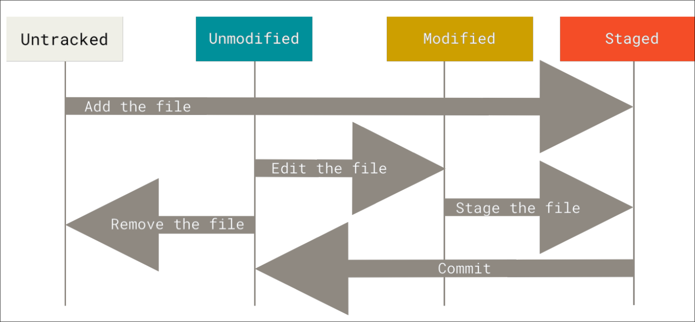
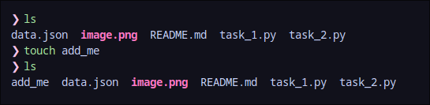
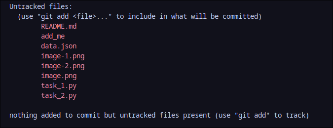
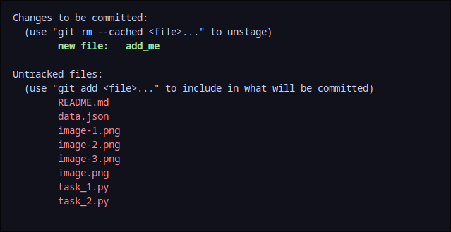

# Level 2

Task: Understanding `git add` and `git status`

| Task   | Run CMD             | Learn What?   | `git` cmd |
| ------ | ------------------- | ------------- | --------- |
| Task 1 | `python task_1.py ` | `git add`     | `add`     |
| Task 2 | `python task_2.py ` | `git status`  | `status`  |
| Task 3 | `python task_3.py ` | `git restore` | `restore` |


> [!IMPORTANT]
> First Run `task_1.py`
>
> ```bash
> python task_1.py
> ```
>
> It will tell you to add some file , so you can type 'n' to exit program or press "CTRL and c" at the same time and interrept it.
> The run the task_1.py again , and answer the question.
>
> Then Run `task_2.py`
>
> ```bash
> python task_2.py
> ```

## `git add`

Git add is used to `add` that file to staging area. I assume no bulb is lit. So

1. What is staging ?
   Imagine some coder(me) coding a simple quiz like [this](https://github.com/aruncs31s/level_1/blob/main/quiz.py). How did that get there? He must have uploaded it. But since we are working with `git` , how do we do that with the `git`?. Good question , we use `git add` to add the files.

Add to where?
Remember the original Question "What is Staging ?" , when you add something using `git add` git goes to staging area. This is a advance topic and you can skip this from here



You can see some new terms in the above picture like

- Untracked Files
- Commit
- Unmodified
- Modified
- Staged

---

In simple terms a file has 4 states

1. Modified: means the contents of the file have been changed
2. Unmodified: you know what it is.
3. Untracked: Which means `git` has nothing to do with this file
4. Staged: `git` do have bussiness with this file

>[!IMPORTANT]
>`git status` is used to check the status of a file

We will now consider these 2 stages Untracked and Staged

- `touch` is used to create an empty file
  

- this is before i created `add_me`
  

- this is after i created `add_me`
  

You can see in the `Untracked file` we now have `add_me` and it says right there `(use "git add <file>....)` so what if we do ?
so i run

```bash
git add add_me
```


Now there is a new section and it says

```
Changes to be committed:
  (use "git rm --cached <file>..." to unstage)
        new file:   add_me
```

is says `.... to unstage` so the file add_me is `staged`.

> In summary , staging means preparing a file for upload. (we will use the term upload now , but it is called something else(push).)

### When do you use the `git add`

1. To add new files to staging area
2. When you modify an exisiting file and upload the modified file.


>[!TIP] 
> You can add multiple files or just add all files using `-A` option
> ```bash
> git add -A
>```

## `git restore`

As i've said earlier , when you use  `git add` the file get stages , so when i file staged the `git` start do things to that file , and one of them is to keep a copy of that file and if you accidently delete a staged file , you can recover it using the following command
```bash
git restore <file name>
```